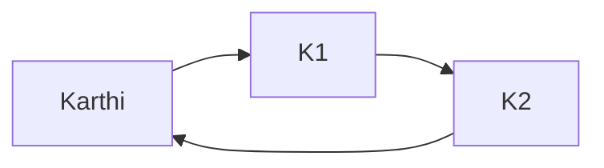

Learnt weird [[Norse Mythology]] fact

Watched [[Simon Clark#Cold War and Climate Change]]

Watched [[Johnny Harris#McDonald's Ice Cream Machines]]

Read [[Maxwell's Demon]] [here](https://www.quantamagazine.org/how-maxwells-demon-continues-to-startle-scientists-20210422/) 
Landauer, Principle of Erasure: Erasing info results in heat dump + entropy increase. Demon is an information processing machine. Stores and erases when making decision on particle. This storing and erasing compensates for entropy loss.
[[Physics]]

Read [[NNs for PDEs]] [here](https://www.quantamagazine.org/new-neural-networks-solve-hardest-equations-faster-than-ever-20210419/)
Basically transformed to Fourier domain, ran through deep net, transformed back. Nets approximate operators if shallow. Demonstrated on simple smooth PDEs so far.
[[NeuralNetworks]]

1. Mermaid learning starts
2. Graph making is cool

