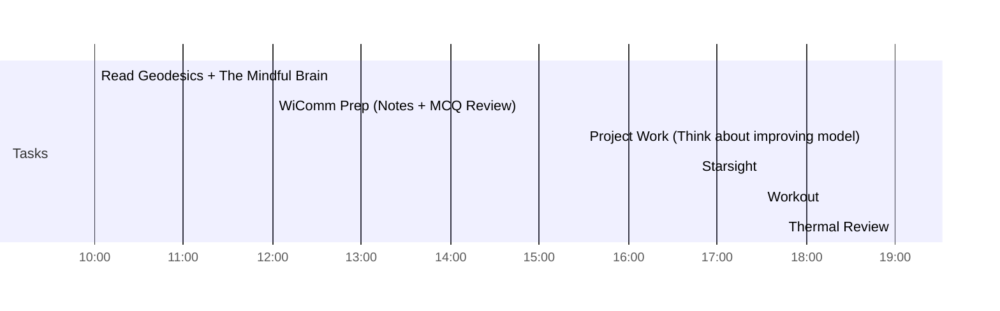

## Day Planner

- [x] 10:00 Read Geodesics + The Mindful Brain
- [x] 12:00 WiComm Prep (Notes + MCQ Review)
- [x] 15:30 Project Work (Think about improving model)
- [x] 16:45 Starsight
- [x] 17:30 Workout
- [x] 19:00 Thermal Review