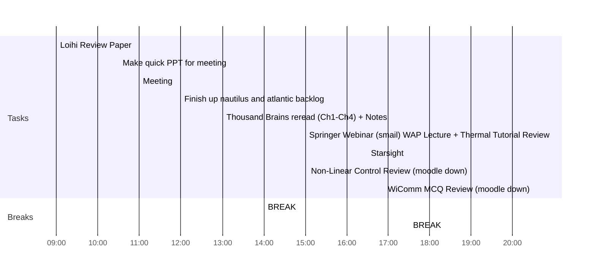

## Day Planner

- [x] 09:00 Loihi Review Paper
- [x] 10:30 Make quick PPT for meeting
- [x] 11:00 Meeting
- [x] 12:00 Finish up nautilus and atlantic backlog
- [x] 13:00 Thousand Brains reread (Ch1-Ch4) + Notes
- [x] 14:00 BREAK
- [x] 15:00 Springer Webinar (smail) WAP Lecture + Thermal Tutorial Review
- [x] 16:30 Starsight
- [x] 17:30 BREAK
- [x] 19:00 Non-Linear Control Review (moodle down)
- [x] 20:30 WiComm MCQ Review (moodle down)