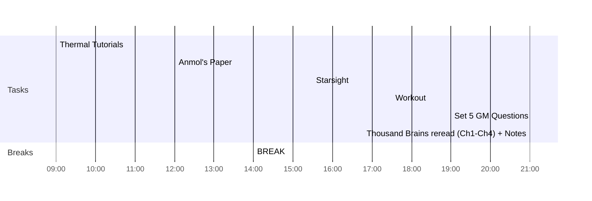

## Day Planner

- [x] 09:00 Thermal Tutorials
- [x] 12:00 Anmol's Paper
- [x] 14:00 BREAK
- [x] 15:30 Starsight
- [x] 17:30 Workout
- [x] 19:00 Set 5 GM Questions
- [ ] 21:00 Thousand Brains reread (Ch1-Ch4) + Notes