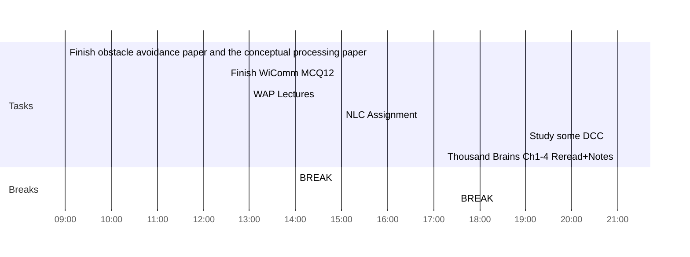

## Day Planner

- [x] 09:00 Finish obstacle avoidance paper and the conceptual processing paper
- [x] 12:30 Finish WiComm MCQ12
- [x] 13:00 WAP Lectures
- [x] 14:00 BREAK
- [x] 15:00 NLC Assignment
- [x] 17:30 BREAK
- [x] 19:00 Study some DCC
- [ ] 21:00 Thousand Brains Ch1-4 Reread+Notes