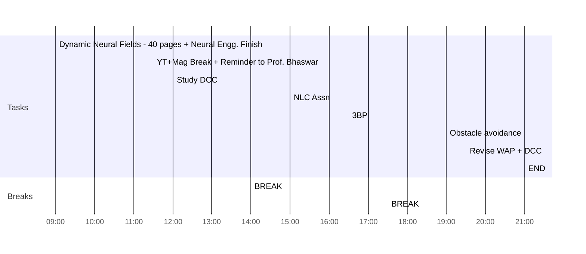

## Day Planner

- [x] 09:00 Dynamic Neural Fields - 40 pages + Neural Engg. Finish
- [x] 11:30 YT+Mag Break + Reminder to Prof. Bhaswar
- [x] 12:00 Study DCC
- [x] 14:00 BREAK
- [x] 15:00 NLC Assn
- [x] 16:30 3BP
- [x] 17:30 BREAK
- [x] 19:00 Obstacle avoidance
- [x] 19:30 Revise WAP + DCC
- [x] 21:00 END