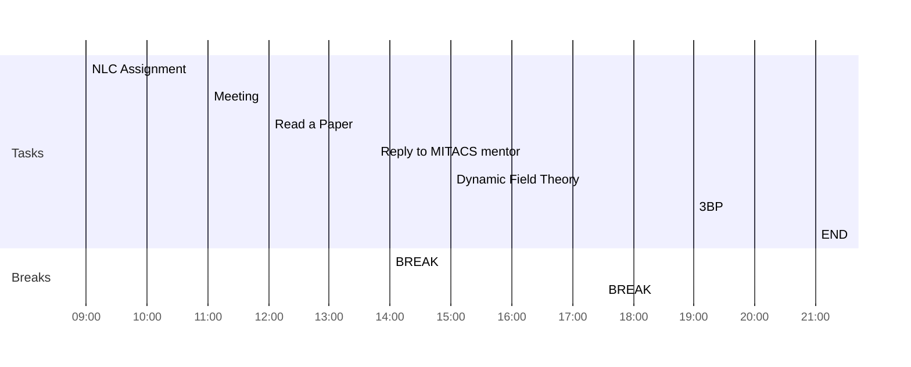

## Day Planner

- [x] 09:00 NLC Assignment
- [x] 11:00 Meeting
- [x] 12:00 Read a Paper
- [x] 13:45 Reply to MITACS mentor
- [x] 14:00 BREAK
- [x] 15:00 Dynamic Field Theory
- [x] 17:30 BREAK
- [x] 19:00 3BP
- [x] 21:00 END