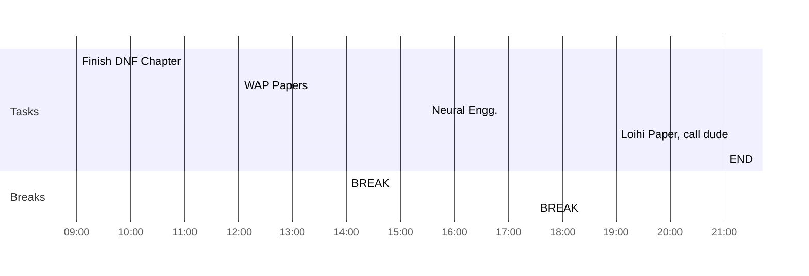

## Day Planner

```mermaid
gantt
    dateFormat  HH-mm
    axisFormat %H:%M
    %% Current Time: 11:59:58 PM
    section Tasks
    Finish DNF Chapter     :09-00, 180mm
    WAP Papers     :12-00, 120mm
    Neural Engg.     :15-30, 120mm
    Loihi Paper, call dude     :19-00, 120mm
    END     :21-00, 0mm
    section Breaks
    BREAK     :14-00, 90mm
    BREAK     :17-30, 90mm
```

- [x] 09:00 Finish DNF Chapter
- [x] 12:00 WAP Papers
- [x] 14:00 BREAK
- [x] 15:30 Neural Engg.
- [x] 17:30 BREAK
- [x] 19:00 Loihi Paper, call dude
- [x] 21:00 END