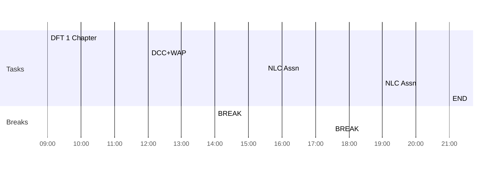

## Day Planner

```mermaid
gantt
    dateFormat  HH-mm
    axisFormat %H:%M
    %% Current Time: 11:59:59 PM
    section Tasks
    DFT 1 Chapter     :09-00, 180mm
    DCC+WAP     :12-00, 120mm
    NLC Assn     :15-30, 120mm
    NLC Assn     :19-00, 120mm
    END     :21-00, 0mm
    section Breaks
    BREAK     :14-00, 90mm
    BREAK     :17-30, 90mm
```

- [ ] 09:00 DFT 1 Chapter
- [ ] 12:00 DCC+WAP
- [x] 14:00 BREAK
- [x] 15:30 NLC Assn
- [x] 17:30 BREAK
- [x] 19:00 NLC Assn
- [x] 21:00 END
