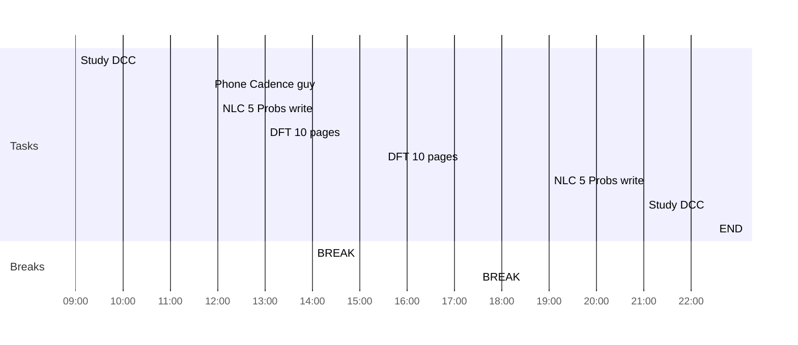

## Day Planner

- [x] 09:00 Study DCC
- [x] 11:50 Phone Cadence guy
- [x] 12:00 NLC 5 Probs write
- [x] 13:00 DFT 10 pages
- [x] 14:00 BREAK
- [x] 15:30 DFT 10 pages
- [x] 17:30 BREAK
- [x] 19:00 NLC 5 Probs write
- [x] 21:00 Study DCC
- [x] 22:30 END