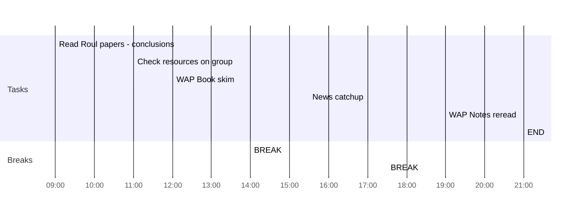

## Day Planner

- [x] 09:00 Read Roul papers - conclusions
- [x] 11:00 Check resources on group
- [x] 12:00 WAP Book skim
- [x] 14:00 BREAK
- [x] 15:30 News catchup
- [x] 17:30 BREAK
- [ ] 19:00 WAP Notes reread
- [ ] 21:00 END