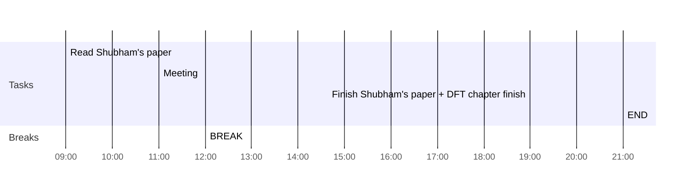

## Day Planner

```mermaid
gantt
    dateFormat  HH-mm
    axisFormat %H:%M
    %% Current Time: 11:59:59 PM
    section Tasks
    Read Shubham's paper     :09-00, 120mm
    Meeting     :11-00, 60mm
    Finish Shubham's paper + DFT chapter finish     :19-00, 120mm
    END     :21-00, 0mm
    section Breaks
    BREAK     :12-00, 420mm
```

- [x] 09:00 Read Shubham's paper
- [x] 11:00 Meeting
- [x] 12:00 BREAK
- [ ] 19:00 Finish Shubham's paper + DFT chapter finish
- [ ] 21:00 END