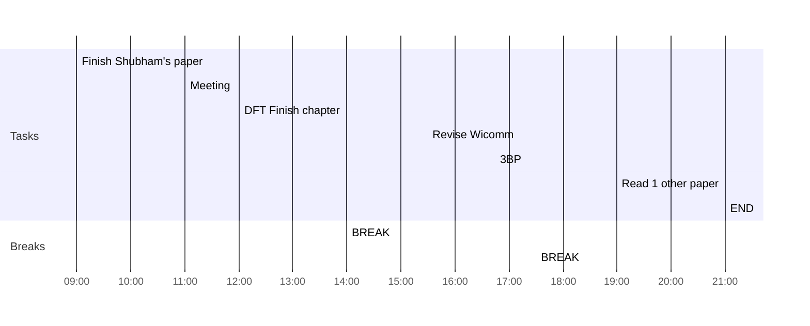

## Day Planner

- [x] 09:00 Finish Shubham's paper
- [x] 11:00 Meeting
- [x] 12:00 DFT Finish chapter
- [x] 14:00 BREAK
- [ ] 15:30 Revise Wicomm
- [x] 16:45 3BP
- [x] 17:30 BREAK
- [ ] 19:00 Read 1 other paper
- [ ] 21:00 END