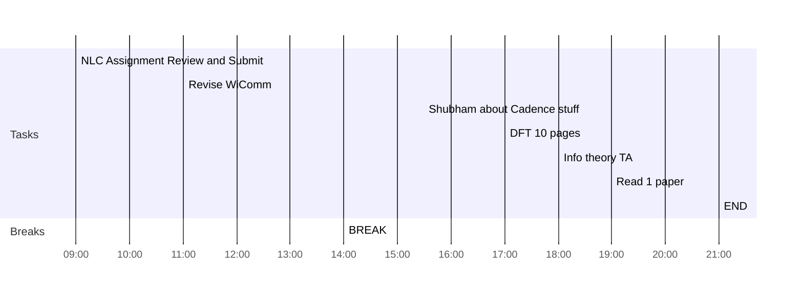

## Day Planner

- [ ] 09:00 NLC Assignment Review and Submit
- [x] 11:00 Revise WiComm
- [x] 14:00 BREAK
- [x] 15:30 Shubham about Cadence stuff
- [ ] 17:00 DFT 10 pages
- [x] 18:00 Info theory TA
- [ ] 19:00 Read 1 paper
- [ ] 21:00 END