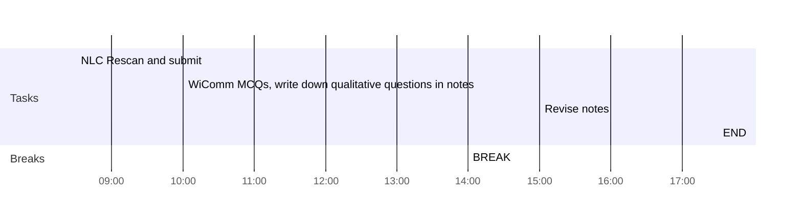

## Day Planner

```mermaid
gantt
    dateFormat  HH-mm
    axisFormat %H:%M
    %% Current Time: 11:59:59 PM
    section Tasks
    NLC Rescan and submit     :08-30, 90mm
    WiComm MCQs, write down qualitative questions in notes     :10-00, 240mm
    Revise notes     :15-00, 150mm
    END     :17-30, 0mm
    section Breaks
    BREAK     :14-00, 60mm
```

- [x] 08:30 NLC Rescan and submit
- [x] 10:00 WiComm MCQs, write down qualitative questions in notes
- [x] 14:00 BREAK
- [ ] 15:00 Revise notes
- [ ] 17:30 END