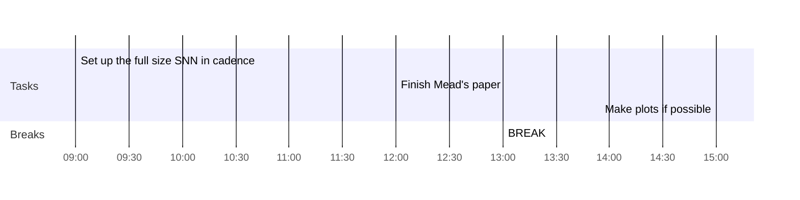

## Day Planner

```mermaid
gantt
    dateFormat  HH-mm
    axisFormat %H:%M
    %% Current Time: 9:34:49 PM
    section Tasks
    Set up the full size SNN in cadence     :09-00, 180mm
    Finish Mead's paper     :12-00, 60mm
    Make plots if possible     :15-00, 0mm
    section Breaks
    BREAK     :13-00, 120mm
```

- [ ] 09:00 Set up the full size SNN in cadence
- [x] 12:00 Finish Mead's paper
- [ ] 13:00 BREAK
- [ ] 15:00 Make plots if possible