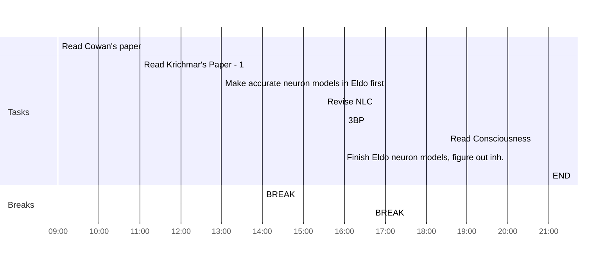

## Day Planner

- [x] 09:00 Read Cowan's paper
- [x] 11:00 Read Krichmar's Paper - 1
- [x] 13:00 Make accurate neuron models in Eldo first
- [x] 14:00 BREAK
- [x] 15:30 Revise NLC
- [x] 16:00 3BP
- [x] 16:40 BREAK
- [ ] 18:30 Read Consciousness
- [ ] 20:00 Finish Eldo neuron models, figure out inh.
- [x] 21:00 END