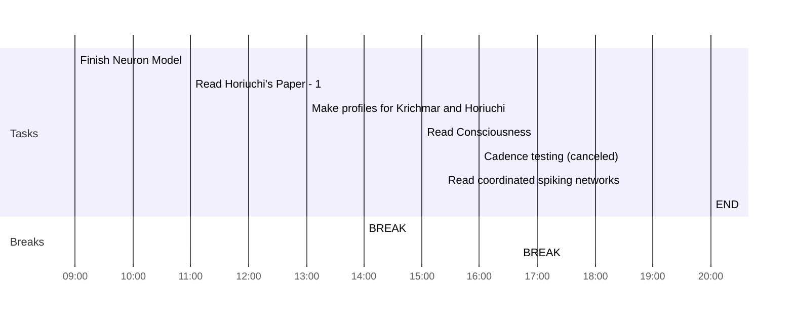

## Day Planner

- [x] 09:00 Finish Neuron Model
- [x] 11:00 Read Horiuchi's Paper - 1
- [x] 13:00 Make profiles for Krichmar and Horiuchi
- [x] 14:00 BREAK
- [x] 15:00 Read Consciousness
- [x] 16:00 Cadence testing (canceled)
- [x] 16:40 BREAK
- [x] 18:30 Read coordinated spiking networks
- [x] 20:00 END