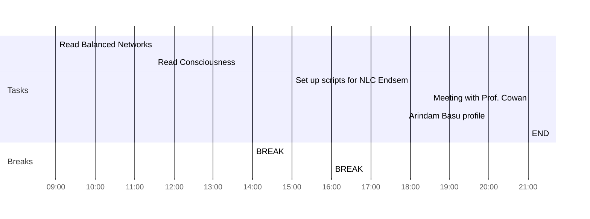

## Day Planner

- [x] 09:00 Read Balanced Networks
- [x] 11:30 Read Consciousness
- [x] 14:00 BREAK
- [x] 15:00 Set up scripts for NLC Endsem
- [x] 16:00 BREAK
- [x] 18:30 Meeting with Prof. Cowan
- [x] 20:00 Arindam Basu profile
- [x] 21:00 END