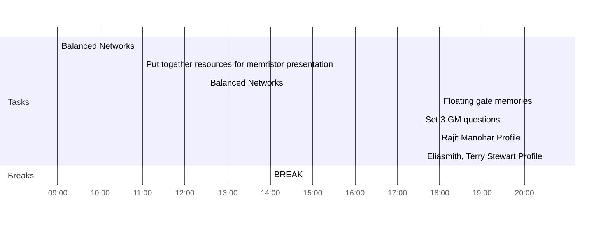

## Day Planner

- [x] 09:00 Balanced Networks
- [x] 11:00 Put together resources for memristor presentation
- [x] 12:30 Balanced Networks
- [x] 14:00 BREAK
- [x] 18:00 Floating gate memories
- [x] 19:30 Set 3 GM questions
- [x] 20:00 Rajit Manohar Profile
- [ ] 20:30 Eliasmith, Terry Stewart Profile