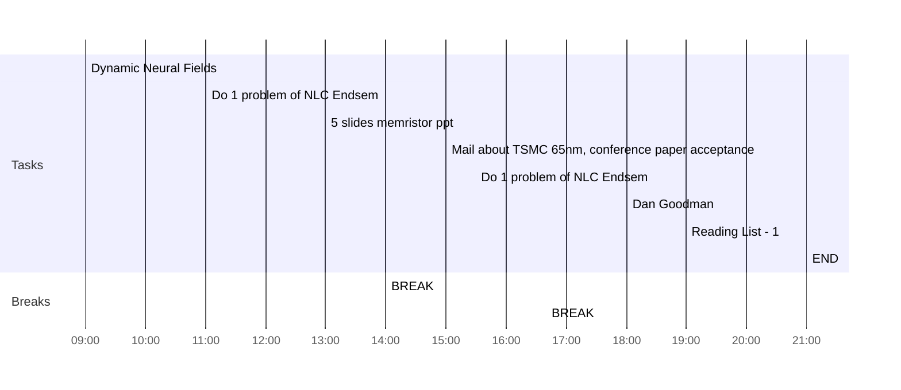

## Day Planner

- [x] 09:00 Dynamic Neural Fields
- [x] 11:00 Do 1 problem of NLC Endsem
- [x] 13:00 5 slides memristor ppt
- [x] 14:00 BREAK
- [x] 15:00 Mail about TSMC 65nm, conference paper acceptance
- [x] 15:30 Do 1 problem of NLC Endsem
- [x] 16:40 BREAK
- [x] 18:00 Dan Goodman
- [x] 19:00 Reading List - 1
- [x] 21:00 END