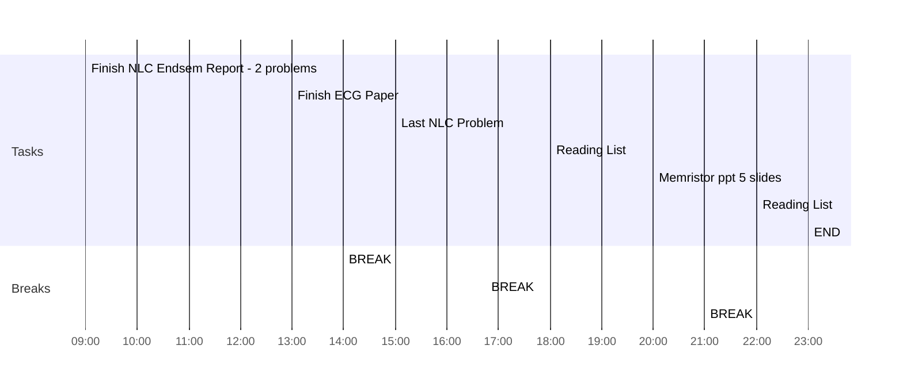

## Day Planner

- [x] 09:00 Finish NLC Endsem Report - 2 problems
- [x] 13:00 Finish ECG Paper
- [x] 14:00 BREAK
- [x] 15:00 Last NLC Problem
- [x] 16:45 BREAK
- [x] 18:00 Reading List
- [x] 20:00 Memristor ppt 5 slides
- [x] 21:00 BREAK
- [x] 22:00 Reading List
- [x] 23:00 END