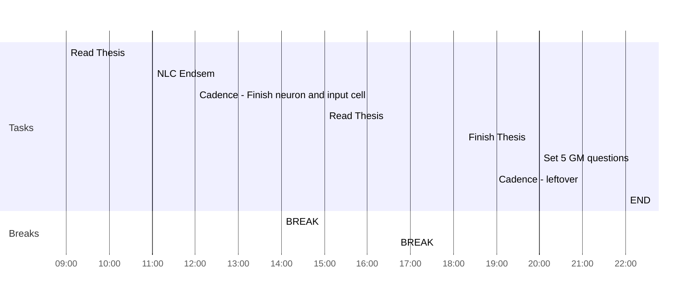

## Day Planner

- [x] 09:00 Read Thesis
- [x] 11:00 NLC Endsem
- [x] 12:00 Cadence - Finish neuron and input cell
- [x] 14:00 BREAK
- [x] 15:00 Read Thesis
- [x] 16:40 BREAK
- [x] 18:15 Finish Thesis
- [ ] 20:00 Set 5 GM questions
- [ ] 21:00 Cadence - leftover
- [ ] 22:00 END