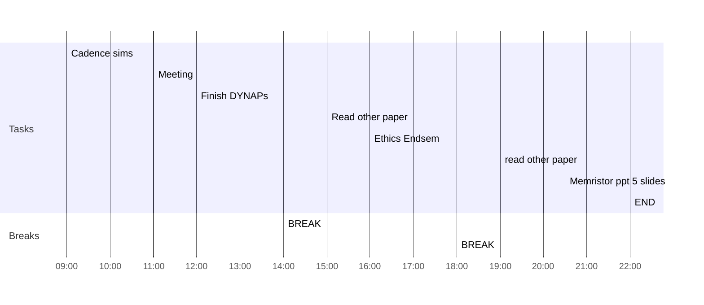

## Day Planner

- [x] 09:00 Cadence sims
- [x] 11:00 Meeting
- [x] 12:00 Finish DYNAPs
- [x] 14:00 BREAK
- [ ] 15:00 Read other paper
- [x] 16:00 Ethics Endsem
- [x] 18:00 BREAK
- [x] 19:00 read other paper
- [x] 20:30 Memristor ppt 5 slides
- [x] 22:00 END