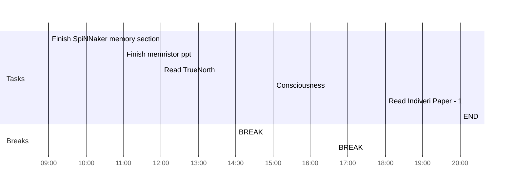

## Day Planner

- [x] 09:00 Finish SpiNNaker memory section
- [x] 11:00 Finish memristor ppt
- [x] 12:00 Read TrueNorth
- [x] 14:00 BREAK
- [x] 15:00 Consciousness
- [x] 16:40 BREAK
- [x] 18:00 Read Indiveri Paper - 1
- [x] 20:00 END