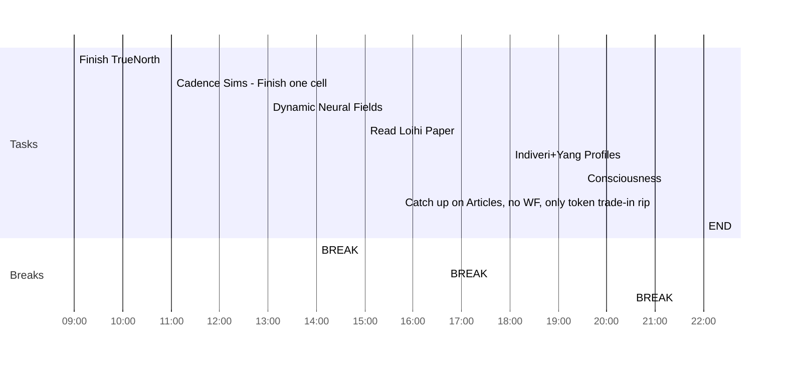

## Day Planner

- [x] 09:00 Finish TrueNorth
- [x] 11:00 Cadence Sims - Finish one cell
- [x] 13:00 Dynamic Neural Fields
- [x] 14:00 BREAK
- [x] 15:00 Read Loihi Paper
- [x] 16:40 BREAK
- [x] 18:00 Indiveri+Yang Profiles
- [x] 19:30 Consciousness
- [x] 20:30 BREAK
- [x] 21:00 Catch up on Articles, no WF, only token trade-in rip
- [x] 22:00 END

Tomorrow 730pm NeuroTech Webinar