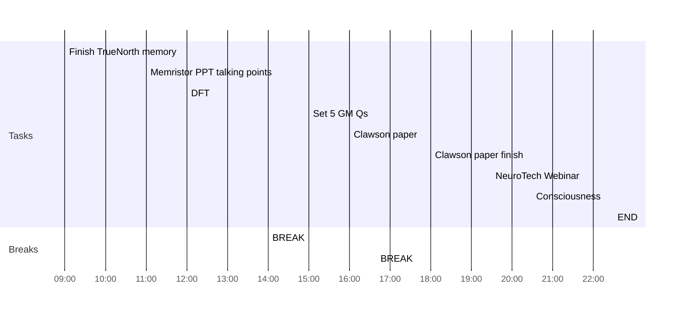

## Day Planner

- [x] 09:00 Finish TrueNorth memory
- [x] 11:00 Memristor PPT talking points
- [x] 12:00 DFT
- [x] 14:00 BREAK
- [x] 15:00 Set 5 GM Qs
- [x] 16:00 Clawson paper
- [x] 16:40 BREAK
- [x] 18:00 Clawson paper finish
- [x] 19:30 NeuroTech Webinar
- [x] 20:30 Consciousness
- [x] 22:30 END