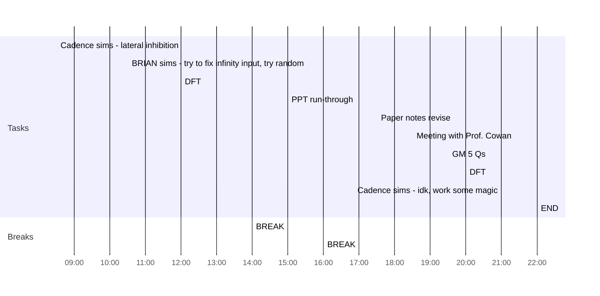

## Day Planner

- [x] 08:30 Cadence sims - lateral inhibition
- [ ] 10:30 BRIAN sims - try to fix infinity input, try random
- [x] 12:00 DFT
- [x] 14:00 BREAK
- [x] 15:00 PPT run-through
- [x] 16:00 BREAK
- [x] 17:30 Paper notes revise
- [x] 18:30 Meeting with Prof. Cowan
- [ ] 19:30 GM 5 Qs
- [ ] 20:00 DFT
- [x] 21:00 Cadence sims - idk, work some magic
- [ ] 22:00 END