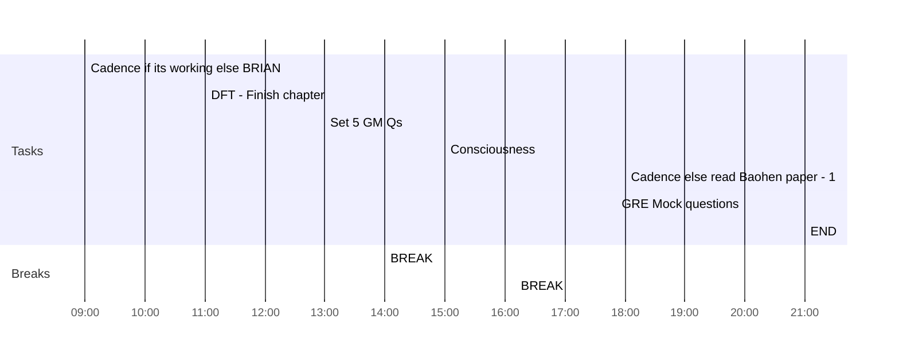

## Day Planner

- [x] 09:00 Cadence if its working else BRIAN
- [x] 11:00 DFT - Finish chapter
- [ ] 13:00 Set 5 GM Qs
- [x] 14:00 BREAK
- [x] 15:00 Consciousness
- [x] 16:10 BREAK
- [x] 18:00 Cadence else read Baohen paper - 1
- [ ] 20:00 GRE Mock questions
- [ ] 21:00 END