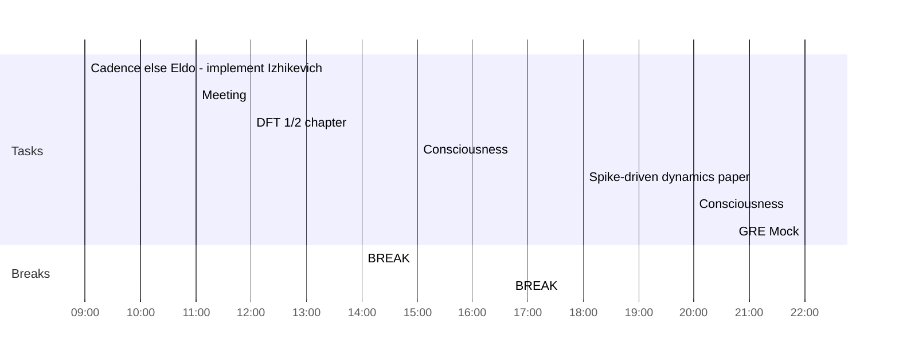

## Day Planner

- [x] 09:00 Cadence else Eldo - implement Izhikevich
- [x] 11:00 Meeting
- [x] 12:00 DFT 1/2 chapter
- [x] 14:00 BREAK
- [x] 15:00 Consciousness
- [x] 16:40 BREAK
- [x] 18:00 Spike-driven dynamics paper
- [x] 20:00 Consciousness
- [x] 22:00 GRE Mock