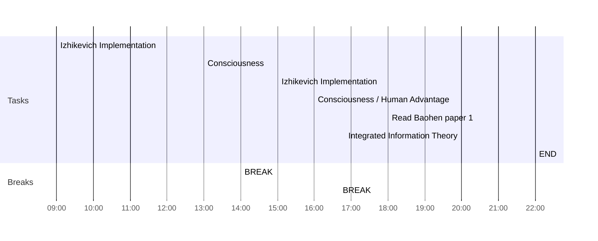

## Day Planner

- [x] 09:00 Izhikevich Implementation
- [x] 13:00 Consciousness
- [x] 14:00 BREAK
- [x] 15:00 Izhikevich Implementation
- [x] 16:00 Consciousness / Human Advantage
- [x] 16:40 BREAK
- [ ] 18:00 Read Baohen paper 1
- [ ] 20:00 Integrated Information Theory
- [ ] 22:00 END