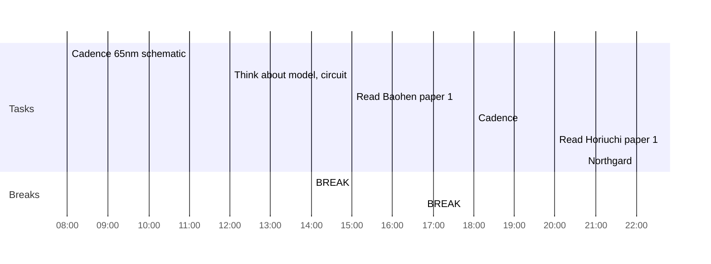

## Day Planner

- [x] 08:00 Cadence 65nm schematic
- [x] 12:00 Think about model, circuit
- [x] 14:00 BREAK
- [x] 15:00 Read Baohen paper 1
- [x] 16:45 BREAK
- [x] 18:00 Cadence
- [x] 20:00 Read Horiuchi paper 1
- [x] 22:00 Northgard
