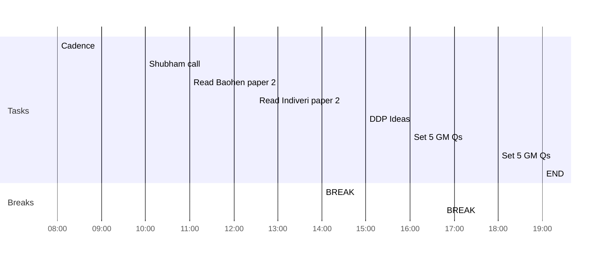

## Day Planner

- [x] 08:00 Cadence
- [x] 10:00 Shubham call
- [x] 11:00 Read Baohen paper 2
- [ ] 12:30 Read Indiveri paper 2
- [x] 14:00 BREAK
- [ ] 15:00 DDP Ideas
- [x] 16:00 Set 5 GM Qs
- [x] 16:45 BREAK
- [x] 18:00 Set 5 GM Qs
- [ ] 19:00 END