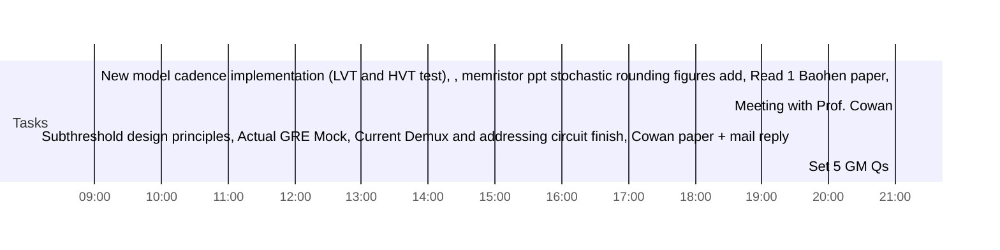

## Day Planner

- [x] 09:00 New model cadence implementation (LVT and HVT test), , memristor ppt stochastic rounding figures add, Read 1 Baohen paper,
- [x] 18:30 Meeting with Prof. Cowan
- [ ] 19:30 Subthreshold design principles, Actual GRE Mock, Current Demux and addressing circuit finish, Cowan paper + mail reply
- [x] 21:00 Set 5 GM Qs