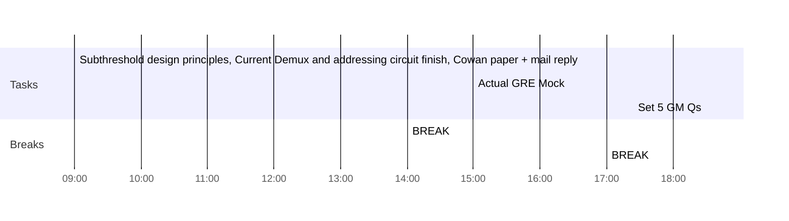

## Day Planner

- [x] 09:00 Subthreshold design principles, Current Demux and addressing circuit finish, Cowan paper + mail reply
- [x] 14:00 BREAK
- [x] 15:00 Actual GRE Mock
- [ ] 17:00 BREAK
- [ ] 18:30 Set 5 GM Qs