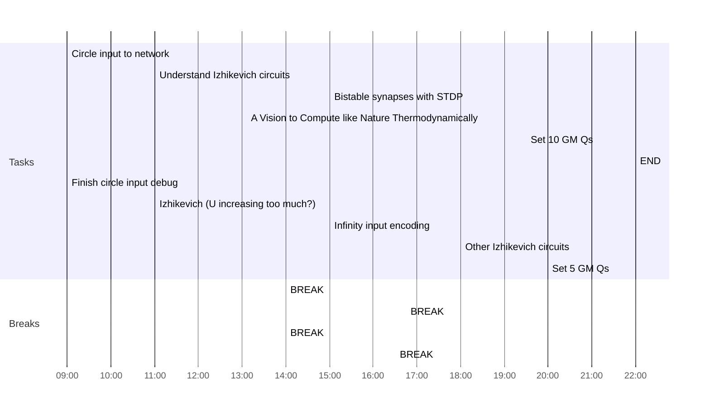

## Day Planner

- [x] 09:00 Circle input to network
- [ ] 11:00 Understand Izhikevich circuits
- [x] 14:00 BREAK
- [x] 15:00 Bistable synapses with STDP
- [x] 16:45 BREAK
- [x] 18:30 A Vision to Compute like Nature Thermodynamically
- [ ] 19:30 Set 10 GM Qs
- [ ] 22:00 END
- [ ] 
