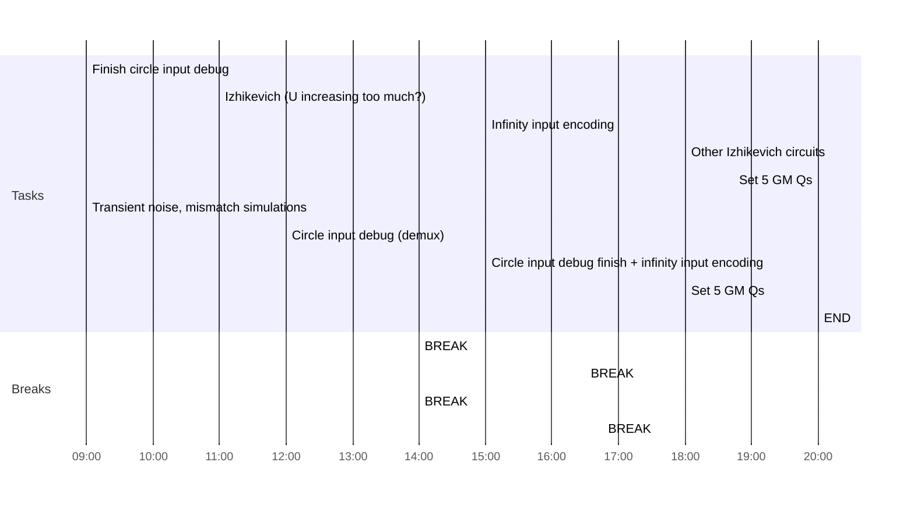

## Day Planner

- [ ] 09:00 Finish circle input debug
- [x] 11:00 Izhikevich (U increasing too much?)
- [ ] 14:00 BREAK
- [ ] 15:00 Infinity input encoding
- [ ] 16:30 BREAK
- [x] 18:00 Other Izhikevich circuits
- [ ] 20:00 Set 5 GM Qs
- [ ] 
