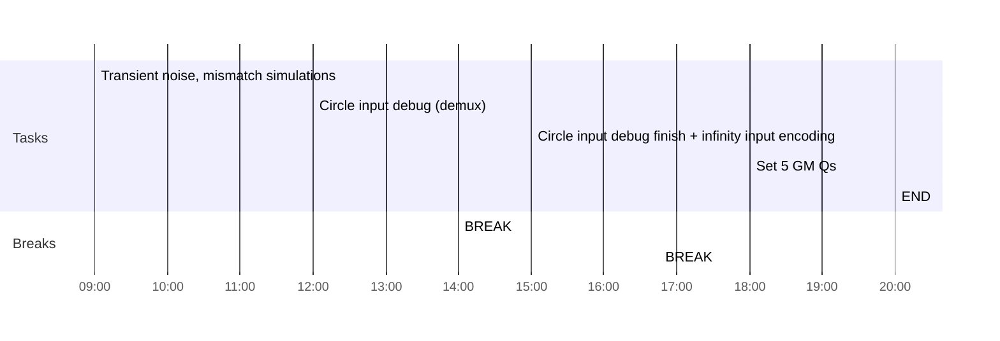

## Day Planner

- [x] 09:00 Transient noise, mismatch simulations
- [ ] 12:00 Circle input debug (demux)
- [ ] 14:00 BREAK
- [ ] 15:00 Circle input debug finish + infinity input encoding
- [ ] 16:45 BREAK
- [ ] 18:00 Set 5 GM Qs
- [ ] 20:00 END