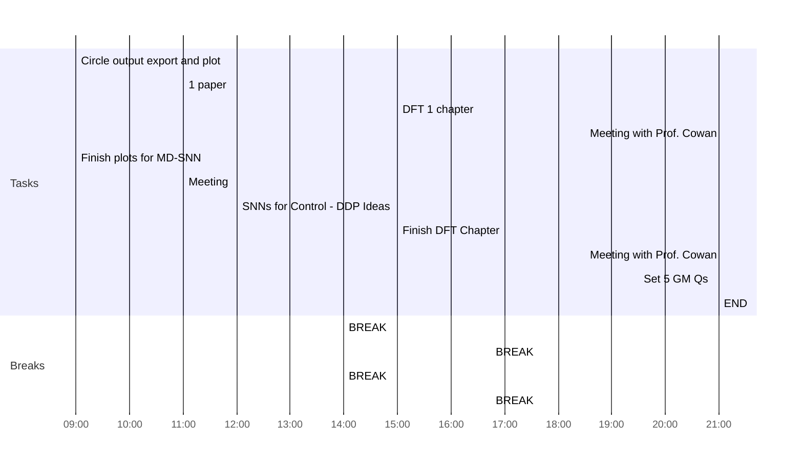

## Day Planner

```mermaid
gantt
    dateFormat  HH-mm
    axisFormat %H:%M
    %% Current Time: 11:59:53 PM
    section Tasks
    Circle output export and plot     :09-00, 120mm
    1 paper     :11-00, 180mm
    DFT 1 chapter     :15-00, 105mm
    Meeting with Prof. Cowan     :18-30, -570mm
    Finish plots for MD-SNN     :09-00, 120mm
    Meeting     :11-00, 60mm
    SNNs for Control - DDP Ideas     :12-00, 120mm
    Finish DFT Chapter     :15-00, 105mm
    Meeting with Prof. Cowan     :18-30, 60mm
    Set 5 GM Qs     :19-30, 90mm
    END     :21-00, 0mm
    section Breaks
    BREAK     :14-00, 60mm
    BREAK     :16-45, 105mm
    BREAK     :14-00, 60mm
    BREAK     :16-45, 105mm
```

- [x] 09:00 Circle output export and plot
- [x] 11:00 1 paper
- [x] 14:00 BREAK
- [ ] 15:00 DFT 1 chapter
- [x] 16:45 BREAK
- [x] 18:30 Meeting with Prof. Cowan

