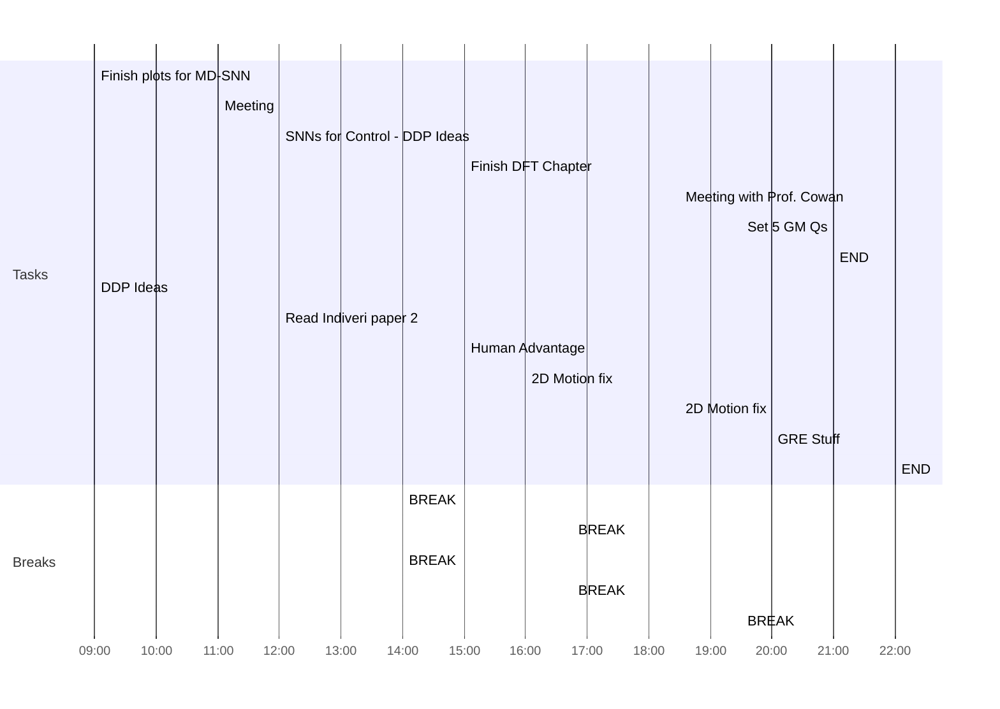

## Day Planner

- [x] 09:00 Finish plots for MD-SNN
- [x] 11:00 Meeting
- [ ] 12:00 SNNs for Control - DDP Ideas
- [x] 14:00 BREAK
- [x] 15:00 Finish DFT Chapter
- [x] 16:45 BREAK
- [x] 18:30 Meeting with Prof. Cowan
- [x] 19:30 Set 5 GM Qs
- [x] 21:00 END

