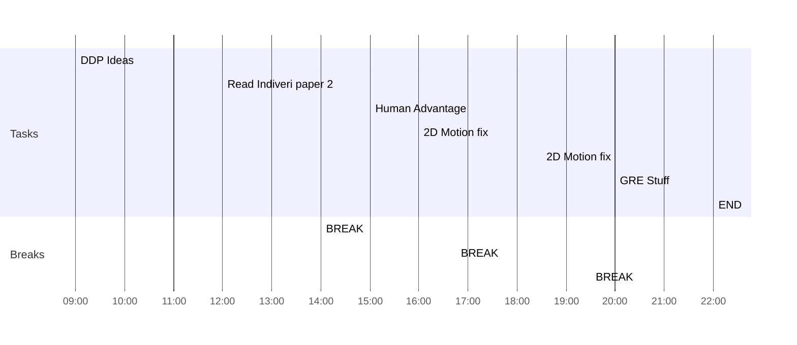

## Day Planner

- [x] 09:00 DDP Ideas
- [x] 12:00 Read Indiveri paper 2
- [x] 14:00 BREAK
- [x] 15:00 Human Advantage
- [x] 16:00 2D Motion fix
- [x] 16:45 BREAK
- [x] 18:30 2D Motion fix
- [x] 19:30 BREAK
- [x] 20:00 GRE Stuff
- [x] 22:00 END

