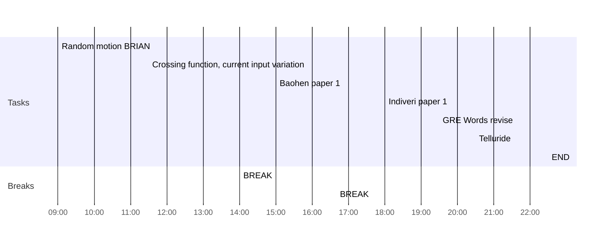

## Day Planner

- [ ] 09:00 Random motion BRIAN
- [x] 11:30 Crossing function, current input variation
- [x] 14:00 BREAK
- [x] 15:00 Baohen paper 1
- [x] 16:40 BREAK
- [x] 18:00 Indiveri paper 1
- [ ] 19:30 GRE Words revise
- [x] 20:30 Telluride
- [x] 22:30 END