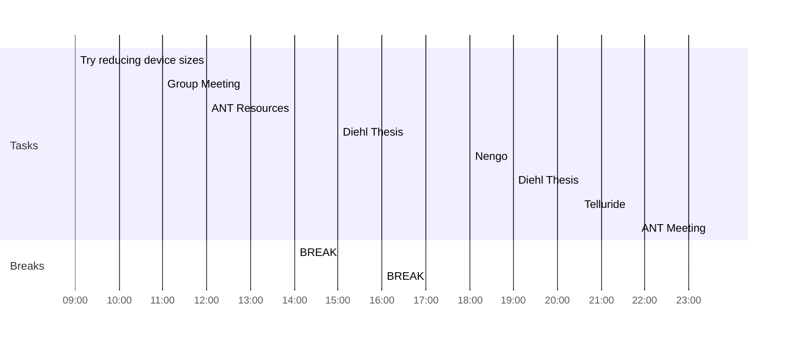

## Day Planner

- [ ] 09:00 Try reducing device sizes
- [x] 11:00 Group Meeting
- [x] 12:00 ANT Resources
- [x] 14:00 BREAK
- [ ] 15:00 Diehl Thesis
- [x] 16:00 BREAK
- [x] 18:00 Nengo
- [ ] 19:00 Diehl Thesis
- [x] 20:30 Telluride
- [ ] 23:30 ANT Meeting

