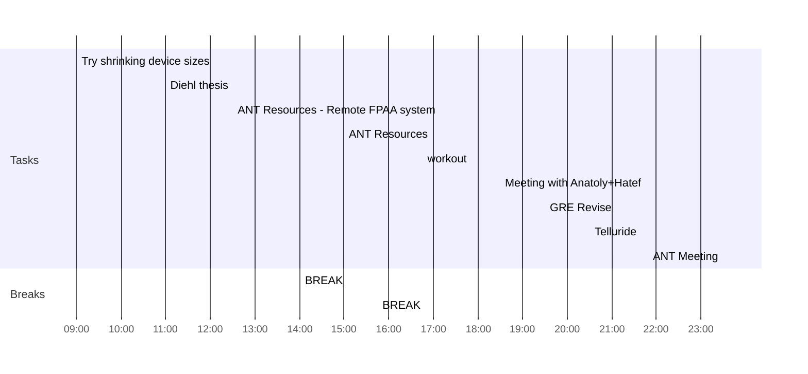

## Day Planner

- [ ] 09:00 Try shrinking device sizes
- [x] 11:00 Diehl thesis
- [x] 12:30 ANT Resources - Remote FPAA system
- [x] 14:00 BREAK
- [ ] 15:00 ANT Resources
- [x] 15:45 BREAK
- [ ] 16:45 workout
- [x] 18:30 Meeting with Anatoly+Hatef
- [ ] 19:30 GRE Revise
- [ ] 20:30 Telluride
- [x] 23:30 ANT Meeting