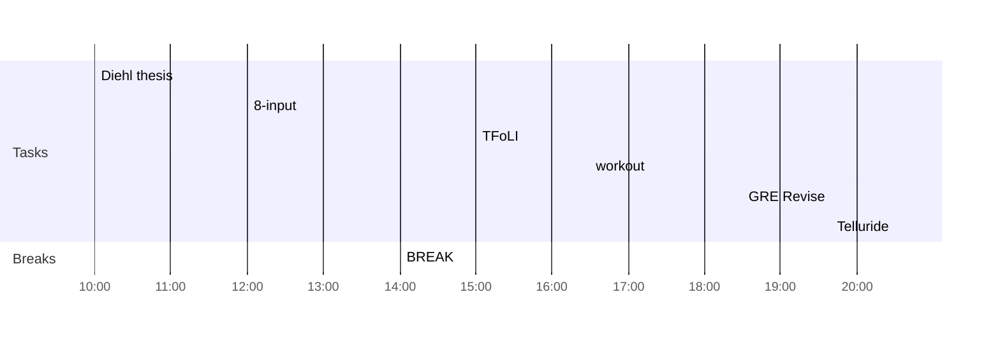

## Day Planner

```mermaid
gantt
    dateFormat  HH-mm
    axisFormat %H:%M
    %% Current Time: 11:59:59 PM
    section Tasks
    Diehl thesis     :10-00, 120mm
    8-input     :12-00, 120mm
    TFoLI     :15-00, 90mm
    workout     :16-30, 120mm
    GRE Revise     :18-30, 120mm
    Telluride     :20-30, 0mm
    section Breaks
    BREAK     :14-00, 60mm
```

- [x] 10:00 Diehl thesis
- [ ] 12:00 8-input
- [x] 14:00 BREAK
- [x] 15:00 TFoLI
- [ ] 16:30 workout
- [ ] 18:30 GRE Revise
- [x] 20:30 Telluride