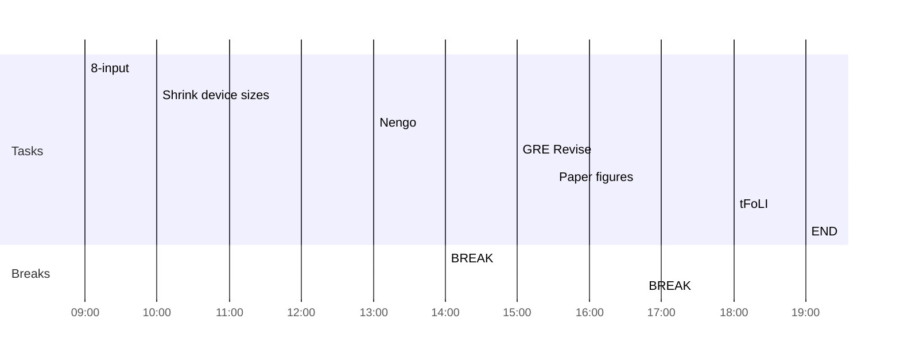

## Day Planner

- [x] 09:00 8-input
- [x] 10:00 Shrink device sizes
- [x] 13:00 Nengo
- [x] 14:00 BREAK
- [x] 15:00 GRE Revise
- [x] 15:30 Paper figures
- [x] 16:45 BREAK
- [x] 18:00 tFoLI
- [x] 19:00 END