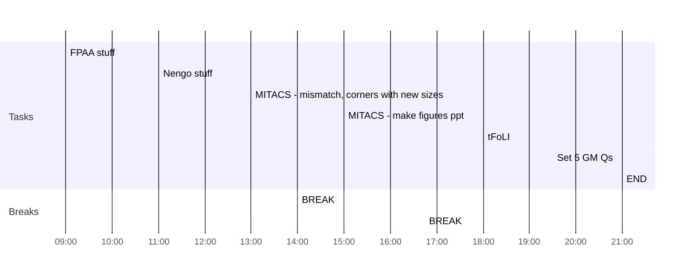

## Day Planner

- [ ] 09:00 FPAA stuff
- [x] 11:00 Nengo stuff
- [x] 13:00 MITACS - mismatch, corners with new sizes
- [x] 14:00 BREAK
- [x] 15:00 MITACS - make figures ppt
- [x] 16:45 BREAK
- [x] 18:00 tFoLI
- [x] 19:30 Set 5 GM Qs
- [x] 21:00 END