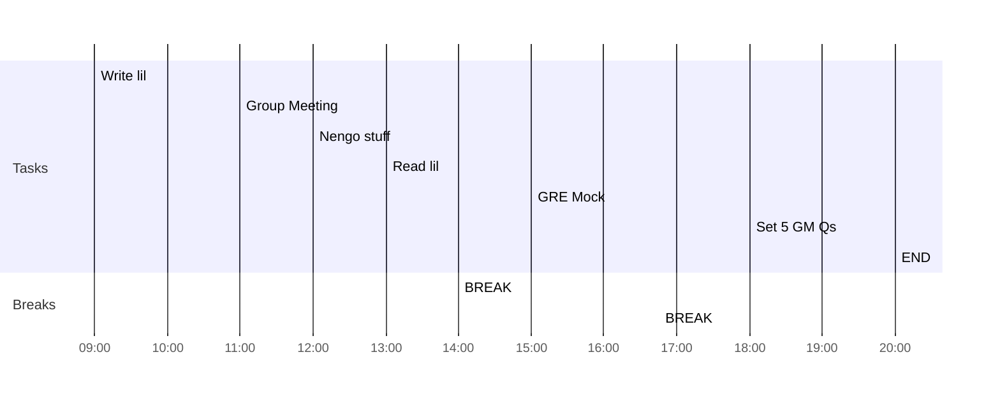

## Day Planner

- [x] 09:00 Write lil
- [x] 11:00 Group Meeting
- [x] 12:00 Nengo stuff
- [x] 13:00 Read lil
- [x] 14:00 BREAK
- [x] 15:00 GRE Mock
- [x] 16:45 BREAK
- [x] 18:00 Set 5 GM Qs
- [x] 20:00 END