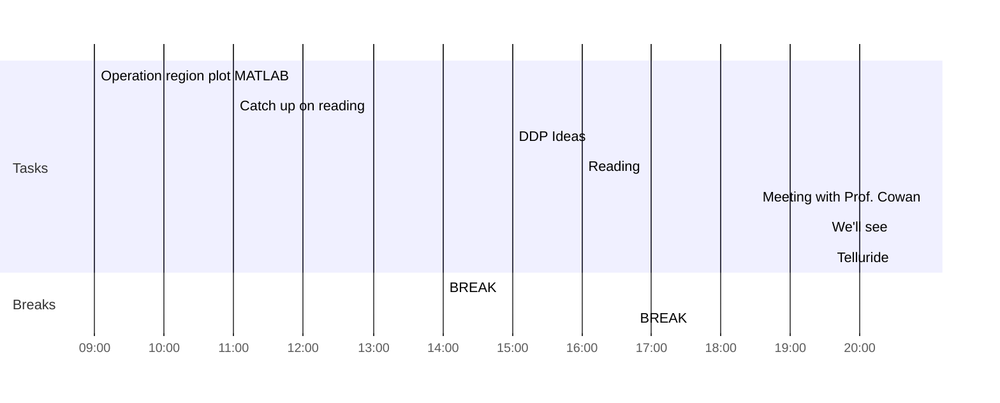

## Day Planner

- [x] 09:00 Operation region plot MATLAB
- [x] 11:00 Catch up on reading
- [x] 14:00 BREAK
- [ ] 15:00 DDP Ideas
- [x] 16:00 Reading
- [x] 16:45 BREAK
- [x] 18:30 Meeting with Prof. Cowan
- [x] 19:30 We'll see
- [ ] 20:30 Telluride