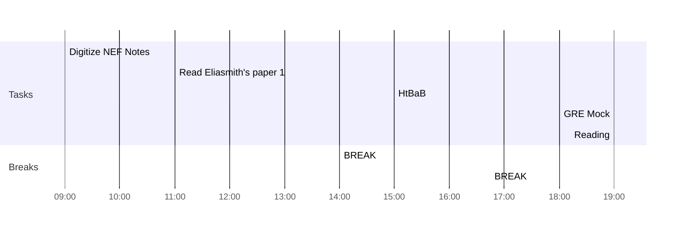

## Day Planner

```mermaid
gantt
    dateFormat  HH-mm
    axisFormat %H:%M
    %% Current Time: 11:59:59 PM
    section Tasks
    Digitize NEF Notes     :09-00, 120mm
    Read Eliasmith's paper 1     :11-00, 180mm
    HtBaB     :15-00, 105mm
    GRE Mock     :18-00, 60mm
    Reading     :19-00, 0mm
    section Breaks
    BREAK     :14-00, 60mm
    BREAK     :16-45, 75mm
```

- [x] 09:00 Digitize NEF Notes
- [ ] 11:00 Read Eliasmith's paper 1
- [x] 14:00 BREAK
- [x] 15:00 HtBaB
- [x] 16:45 BREAK
- [ ] 18:00 GRE Mock
- [ ] 19:00 Reading